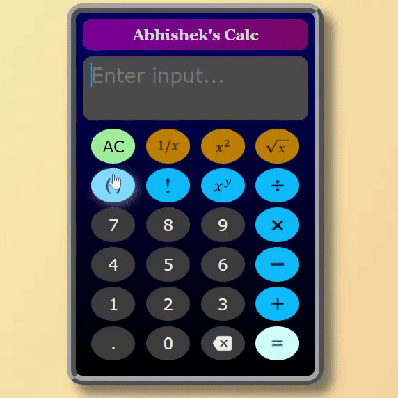
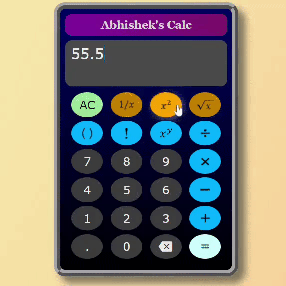
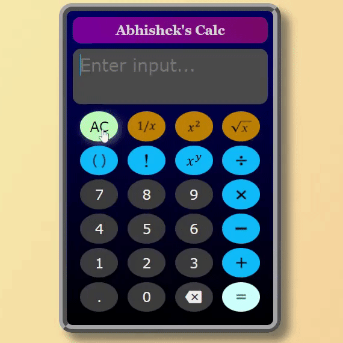
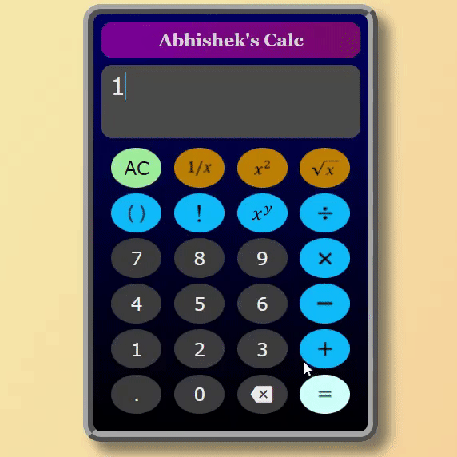

# Calc-Web-Component
Hi there&#128075; &nbsp;&nbsp;&nbsp;This is a **Standard Calculator** `web component` (custom element) built using HTML, CSS, and JS.

> Click &#128073; [`THIS LINK`](https://abhishek-calc.herokuapp.com/) to see it in action &#128578;

## Demo Clips &#128071;

<table height="1000">
  <tr>
    <td></td>
    <td>
  <tr>
    <tr>
    <td>
    <td>
  <tr>
</table>
